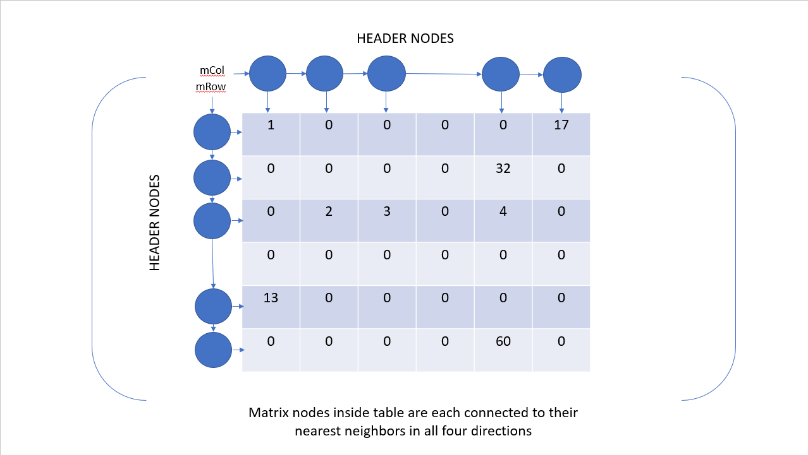

# SparseMatrix
Sparse matrix implementation used as a learning exercise while studying data structures and algorithms. Built using C++.

## Use case
A sparse matrix is useful for saving space when much of the data in a typical matrix is comprised of "empty values". These values don't have any value in being stored in a typical matrix and are only used to maintain the structure of the data. However, a sparse matrix will avoid storing all of these "empty values" at the cost of a number of header nodes used to keep track of locations with meaningful data and allow quick access to this data.

## Implementation
C++ templates are used to enable to user of the data structure to use store whatever types of data they desire. Copy and move functionality are implemented. A destructor cleans up the pointers when necessary. Matrix addition, multiplication, and transposition are supported as well.

The node classes declare the `SparseMatrix` class as a friend class in order to have the nodes simply hold data, while data manipulation is handled by the `SparseMatrix` parent.

Finding a given value is found by using provided coordinates to traverse through the column headers. If a column header for the provided column exists, search the column for the matching node and return the value or return 0.

Insertion and removal require similar navigation, but the row headers must also be used so that pointers can be updated appropriately.
